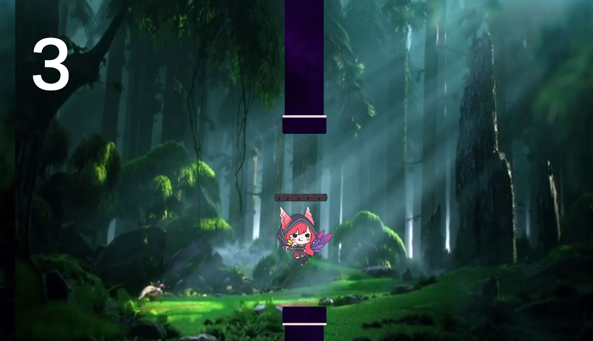

# 🕊️ Flappy Xayah - Mon premier projet Unity

Bienvenue dans **Flappy Xayah**, mon tout premier jeu réalisé avec **Unity** !  
Il s'agit d'une version revisitée de Flappy Bird sur le thème de **League of Legends**, avec **Xayah** en personnage principal. 🦅

---

## 🎮 Gameplay

> Incarnez **Xayah** et volez entre les tuyaux comme une pro du skillshot... mais avec des plumes !

- 🪶 Xayah peut lancer jusqu’à **5 plumes** pour **ouvrir un tuyau**.
- ✅ Lorsqu’elle **passe entre deux tuyaux**, son nombre de plumes est **réinitialisé**.
- 🎯 Le but est de **viser juste**, **ouvrir le passage** et **enchaîner les points** !

---

## ⚙️ Développé avec

- [Unity](https://unity.com/)
- [C#](https://learn.microsoft.com/fr-fr/dotnet/csharp/)
---
